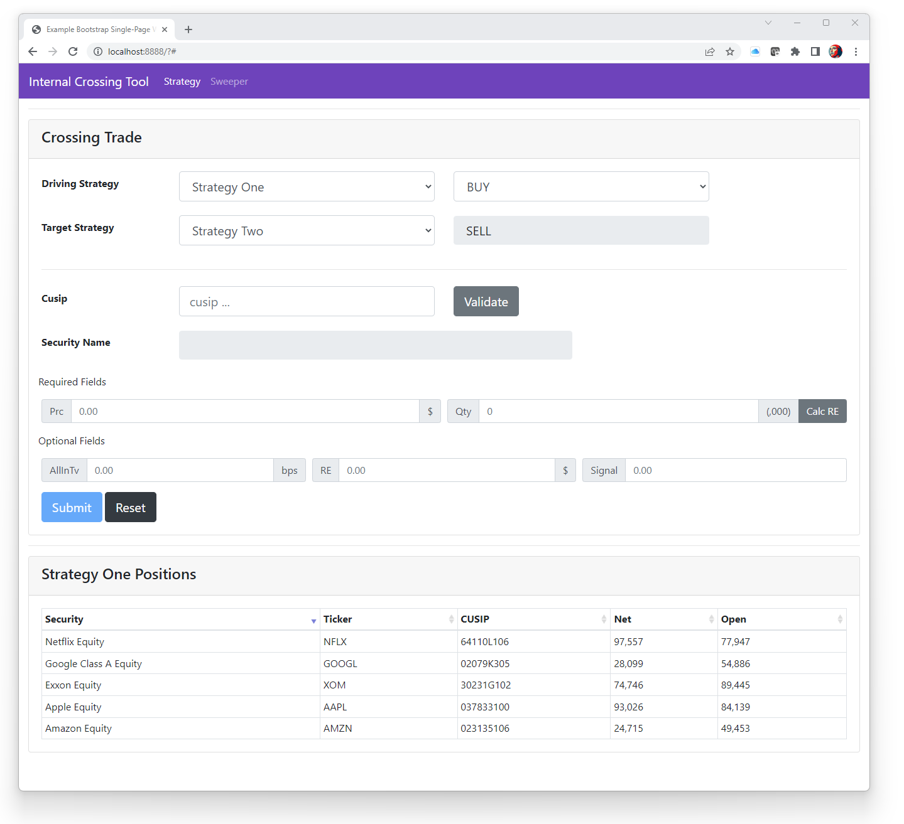

# webapp
Example single-page webapp via Java Spark and Bootstrap


## Application building blocks
> [Spark](http://sparkjava.com) - A micro framework for creating web applications in Kotlin and Java 8 with minimal effort

> [Bootstrap](https://getbootstrap.com) - Powerful, extensible, and feature-packed frontend toolkit

> [Gradle](https://gradle.org/) - Universal build tool for Java (and many other languages)


## Building
This project uses VSCode .devcontainer support -- look in the directory for a sample Dockerfile if you want to roll your own, otherwise just start VSCode and re-open this project in a container.
```
git clone git@github.com:mattygiedt/webapp.git
cd webapp
code . <open project inside dev container>
root@272aebfa0282:/workspaces/webapp# gradle clean build

BUILD SUCCESSFUL in 844ms
13 actionable tasks: 13 up-to-date
root@272aebfa0282:/workspaces/webapp#
```


## Configuration
Logback, Banner and Spark configuration files are located under the `/app/src/main/resources` directory. These are brought together with a protobuf-based `resources/config/webapp.conf` file. I have found protobuf to be excellent for application / system / enterprise configuration as the reflection and code-generation capabilities allow you to leverage the config-as-code DevOps paradigm to the extreme. Flatbuffers has replaced protobuf in the performance and messaging arena, but I find protobuf to be better for 'human readable' workflows.


## Run the WebApp
```
root@272aebfa0282:/workspaces/webapp# gradle run

> Task :app:run
JoranConfigurator configuration file from application configuration: logging/logback.xml
2023-01-13 19:02:02.286 [main] INFO  webapp.App -

 __ __ __   ______    _______   ________   ______   ______     ______   ______   ___ __ __   ______
/_//_//_/\ /_____/\ /_______/\ /_______/\ /_____/\ /_____/\   /_____/\ /_____/\ /__//_//_/\ /_____/\
\:\\:\\:\ \\::::_\/_\::: _  \ \\::: _  \ \\:::_ \ \\:::_ \ \  \:::_ \ \\::::_\/_\::\| \| \ \\:::_ \ \
 \:\\:\\:\ \\:\/___/\\::(_)  \/_\::(_)  \ \\:(_) \ \\:(_) \ \  \:\ \ \ \\:\/___/\\:.      \ \\:\ \ \ \
  \:\\:\\:\ \\::___\/_\::  _  \ \\:: __  \ \\: ___\/ \: ___\/   \:\ \ \ \\::___\/_\:.\-/\  \ \\:\ \ \ \
   \:\\:\\:\ \\:\____/\\::(_)  \ \\:.\ \  \ \\ \ \    \ \ \      \:\/.:| |\:\____/\\. \  \  \ \\:\_\ \ \
    \_______\/ \_____\/ \_______\/ \__\/\__\/ \_\/     \_\/       \____/_/ \_____\/ \__\/ \__\/ \_____\/


2023-01-13 19:02:02.301 [main] INFO  s.s.StaticFilesConfiguration - StaticResourceHandler configured with folder = /public/webapp
2023-01-13 19:02:02.344 [Thread-1] INFO  org.eclipse.jetty.util.log - Logging initialized @507ms to org.eclipse.jetty.util.log.Slf4jLog
2023-01-13 19:02:02.482 [Thread-1] INFO  s.e.jetty.EmbeddedJettyServer - == Spark has ignited ...
2023-01-13 19:02:02.483 [Thread-1] INFO  s.e.jetty.EmbeddedJettyServer - >> Listening on 0.0.0.0:8888
2023-01-13 19:02:02.485 [Thread-1] INFO  org.eclipse.jetty.server.Server - jetty-9.4.48.v20220622; built: 2022-06-21T20:42:25.880Z; git: 6b67c5719d1f4371b33655ff2d047d24e171e49a; jvm 17.0.5+8-Ubuntu-2ubuntu120.04
2023-01-13 19:02:02.512 [Thread-1] INFO  org.eclipse.jetty.server.session - DefaultSessionIdManager workerName=node0
2023-01-13 19:02:02.512 [Thread-1] INFO  org.eclipse.jetty.server.session - No SessionScavenger set, using defaults
2023-01-13 19:02:02.515 [Thread-1] INFO  org.eclipse.jetty.server.session - node0 Scavenging every 600000ms
2023-01-13 19:02:02.540 [Thread-1] INFO  o.e.j.server.handler.ContextHandler - Started o.e.j.s.ServletContextHandler@12d6110c{/,null,AVAILABLE}
2023-01-13 19:02:02.569 [Thread-1] INFO  o.e.jetty.server.AbstractConnector - Started ServerConnector@7f0e2966{HTTP/1.1, (http/1.1)}{0.0.0.0:8888}
2023-01-13 19:02:02.572 [Thread-1] INFO  org.eclipse.jetty.server.Server - Started @738ms
<=========----> 75% EXECUTING [28s]
> :app:run
```


## Open a browser and view the HTML
Try clicking [here](http://localhost:8888) once you've started the webapp, assuming you haven't made any config changes.

After playing around for a bit, you should be able to generate something that looks like:

